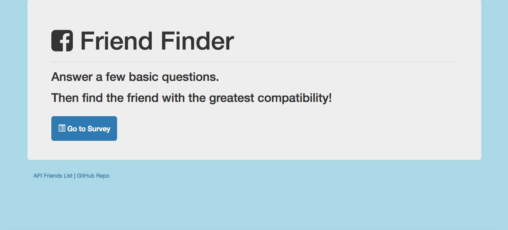

# FriendFinder

*Here is the link to the deployed application: https://testapp12141.herokuapp.com/*

This application is created in the purpose of testing heroku and express. Similar to Tinder, we have created a friend finder application. This application takes the users answers from the survey given and matches their scores to a list of users that are prepopulated.

### Installation

1. Clone the repository.
2. You will need download the necessary npm packages in the downloaded repository. 
3. You would also need a heroku account to deploy the application.


## Packages
These are some of the packages needed to run the application.

1. Express

```npm install express```

2. Body Parser

```npm install body-parser```

3. Path

```npm install path```


## Functionality



1. This application uses modules to keeps file clean and organized.
2. This application creates a makeshift API database to store users' entered information. 
3. Surveyed answers will be converted to a score that is compared to the users in the database. 
4. Scores are matched and the users with the closes matched answers to the surveyed individual. Then the matched users will show up in a modal.